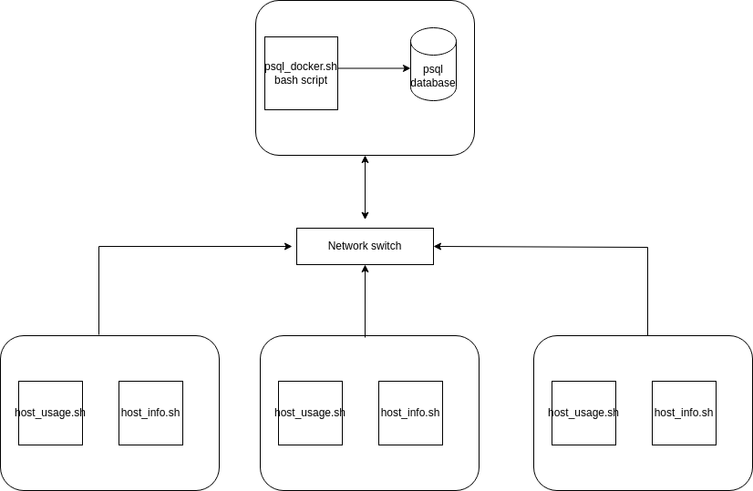

# Introduction
The project involved creating a monitoring app that records hardware specifications and monitors real-time server usage and storing the data in a PostgreSQL database. The purpose of the collected data is to aid users in future resource planning, such as adding or removing servers, optimizing underused servers with more software and apps, and acquiring new servers to reduce the load on overused ones. Testing was done manually on the CentOS VM, hosted on GCP. The technologies used for the resource monitoring app include Bash scripts for hardware and server usage data collection, Docker for PostgreSQL database provisioning, and Git/GitHub for code version control.

# Quick Start

**Start a PostgreSQL instance using `psql_docker.sh`:**
This script sets up a Docker container running PostgreSQL
```
# To create the PostgreSQL docker container
./scripts/psql_docker.sh create db_username db_password

# Example 
./scripts/psql_docker.sh create postgres password
```
**Create tables using `ddl.sql`:**
The ddl.sql script defines the structure of the host_agent database, including the two tables used to store hardware specifications and resource usage data. against the psql instance
```
-- connect to the psql instance
psql -h localhost -U postgres -W
-- create the host_agent database 
postgres=# CREATE DATABASE host_agent; 
-- connect to the new database
postgres=# \c host_agent;
-- disconnect to the new host_agent database
postgres=# \q

-- Execute ddl.sql script on the host_agent database against the psql instance to create the tables
psql -h localhost -U postgres -d host_agent -f sql/ddl.sql
```

**Insert hardware specifications data into the database using `host_info.sh`:**
Run this script on each server to collect hardware specifications. This information is inserted into the database and only needs to be executed once during installation.
```
# Script usage 
bash scripts/host_info.sh psql_host psql_port db_name psql_user psql_password 
# Example 
bash scripts/host_info.sh localhost 5432 host_agent postgres password
```
**Collect and insert hardware usage data into the database using `host_usage.sh`:**
This script continuously collects real-time server usage data, including CPU and Memory, and inserts it into the database. The script is scheduled to run every minute using crontab.
```
# Script usage 
bash scripts/host_usage.sh psql_host psql_port db_name psql_user psql_password 
# Example 
bash scripts/host_usage.sh localhost 5432 host_agent postgres password
```
**Set up the crontab to automate data collection:**
Configure the crontab to execute `host_usage.sh` at regular intervals, ensuring that data is collected and stored in the database every minute.
```
# edit crontab jobs
bash> crontab -e

# add this to crontab
# make sure you are using the correct file location for your script
* * * * * bash /home/centos/dev/jrvs/bootcamp/linux_sql/host_agent/scripts/host_usage.sh localhost 5432 host_agent postgres password 

# list crontab jobs
crontab -l
```

**Validate your result from the psql instance**
```
psql -h localhost -U postgres -W
\l to list the dbs
\c host_agent
\dt to list he tables/relations
> SELECT * FROM host_usage;
\q to quit psql instance
```


# Implemenation

I began by establishing a Dockerized PostgreSQL environment using the psql_docker.sh script. Inside this Dockerized PostgreSQL environment, I created the host_agent database and defined its structure with the ddl.sql script, generating the host_info and host_usage tables. To automate harware and server usage data collection, I developed two Bash scripts: host_info.sh, responsible for gathering and inserting hardware specification data into the host_info table, and host_usage.sh, designed to continuously collect real-time server resource usage data, including CPU and memory, and insert it into the host_usage table. Finally, I configured crontab to automatically run the host_usage.sh script every minute, facilitating efficient data collection and regular reporting of server usage data.

## Architecture




## Scripts
**Key scripts used in the project:**

**`psql_docker.sh`:** 

This script simplifies the setup process by starting a Docker container running a PostgreSQL instance, making it easy to work with the database.
```
# script usage ./scripts/psql_docker.sh start|stop|create [db_username][db_password]
```

**`host_info.sh`:** 

Collects hardware specification data and inserts it into the database. This script is executed only once during the initial installation of the monitoring system.

```
# Script usage 
bash scripts/host_info.sh psql_host psql_port db_name psql_user psql_password 
# Example 
bash scripts/host_info.sh localhost 5432 host_agent postgres password
```

**`host_usage.sh`:** 

Collects real-time server resource usage data, including CPU and Memory, and inserts it into the database. This script is scheduled to run every minute using crontab for continuous data collection.

```
# Script usage 
bash scripts/host_usage.sh psql_host psql_port db_name psql_user psql_password 
# Example 
bash scripts/host_usage.sh localhost 5432 host_agent postgres password
```

**`crontab`:** 

The crontab configuration file specifies when and how often `host_usage.sh` should be executed to ensure data is consistently collected.

```
crontab -l

# validate your result from the psql instance
psql -h localhost -U postgres -W
\l to list the dbs
\c host_agent
\dt to list he tables/relations
> SELECT * FROM host_usage;
\q to quit psql instance
```

**`queries.sql`:** 

This file contains SQL queries to address various business questions by utilizing the collected data. It serves as a starting point for generating reports and insights from the data.
The queries.sql script contains multiple queries which can be used to inform resource allocation

## Database Modeling

**The project contains two main tables in the host_agent database:**

**host_info Table:**
The host_info table contains hardware specifications for each host. The following is the host_info table schema:


| Column Name       | Data Type  | Constraints       | Description                                      |
|-------------------|------------|-------------------|--------------------------------------------------|
| id                | SERIAL     | PRIMARY KEY      | Unique auto-incremented identifier for each host|
| hostname          | VARCHAR    | NOT NULL, UNIQUE | Unique string representing the hostname of the host|
| cpu_number        | INT2       | NOT NULL          | Number of CPUs on the host                      |
| cpu_architecture  | VARCHAR    | NOT NULL          | String describing the CPU architecture         |
| cpu_model         | VARCHAR    | NOT NULL          | String specifying the CPU model                 |
| cpu_mhz           | FLOAT8     | NOT NULL          | CPU clock speed in megahertz                    |
| l2_cache          | INT4       | NOT NULL          | L2 cache size in bytes                          |
| timestamp         | TIMESTAMP  |                   | Timestamp indicating when the data was collected (nullable)|
| total_mem         | INT4       |                   | Total memory available on the host in bytes (nullable)|


**host_usage Table:**
The host_usage table records contains server usage information for each host. The following is the host_usage table schema:


| Column Name     | Data Type | Constraints                    | Description                                      |
|-----------------|-----------|--------------------------------|--------------------------------------------------|
| timestamp       | TIMESTAMP | NOT NULL                       | Timestamp indicating when host usage data was recorded|
| host_id         | SERIAL    | NOT NULL                       | Foreign key referencing `id` in `host_info` for host identification|
| memory_free     | INT4      | NOT NULL                       | Amount of free memory in bytes                   |
| cpu_idle        | INT2      | NOT NULL                       | Percentage of CPU idle time                     |
| cpu_kernel      | INT2      | NOT NULL                       | Percentage of CPU kernel time                   |
| disk_io         | INT4      | NOT NULL                       | Number of disk input/output operations          |
| disk_available  | INT4      | NOT NULL                       | Amount of available disk space in bytes        |


# Test
The project was tested manually to verify the functionality of the Bash scripts. The SQL scripts were also tested against test data created by developers to ensure accurate results.

# Deployment
In deploying the monitoring app, I set up Git repositories for source code management, configured crontab for automated data collection, and provisioned the database using Docker. 

# Improvements
- Enhancing security measures for data protection
- Handling hardware updates for accurate data collection
- Implementing advanced monitoring and alerting features when resources are underutilized or if resource usage reaches critial levels

