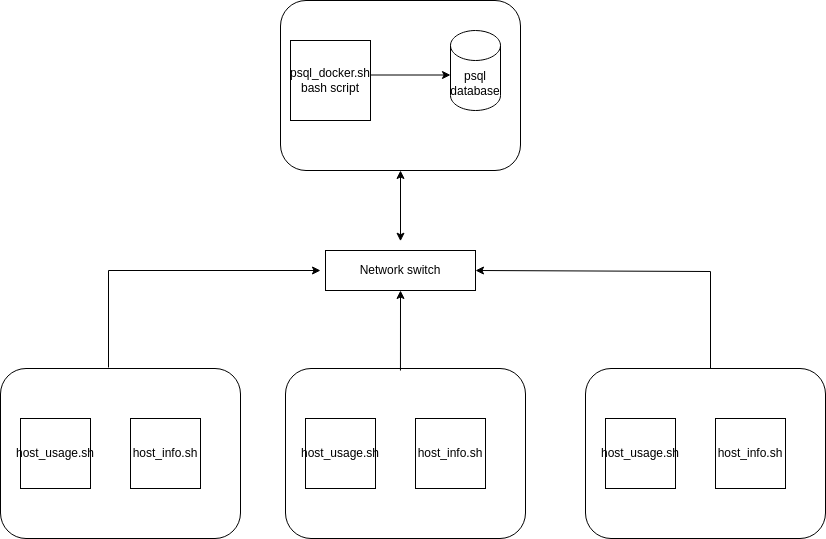

# Introduction
Jarvis has a Linux Cluster Administration (LCA) team that manages a Linux CentOS 7 cluster of 10 servers. The main project goal is to create an MVP for the LCA team that records the hardware specs for each server, and monitors and records real-time linux server usage data from CPU to memory usage. This data is stored in a PostgreSQL RDBMS for future resource planning, such as adding or removing servers. The collected data is used to generate reports for resource planning, optimizing underused servers with more software and apps and acquiring new servers to reduce the load for overused ones. The project utilizes Bash scripts for hardware and server usage data collection, Docker for PostgreSQL RDBMS provisioning, and Git/GitHub for code version control, ensuring efficient data management and development.

# Quick Start

1. **Start a PostgreSQL instance using `psql_docker.sh`:**
This script sets up a Docker container running PostgreSQL, which allows you to quickly create and manage the database.
```
To create the PostgreSQL docker container
./scripts/psql_docker.sh create db_username db_password
# Example 
./scripts/psql_docker.sh create postgres password
```
2. **Create tables using `ddl.sql`:**
- The ddl.sql script defines the structure of the host_agent database, including the two tables used to store hardware specifications and resource usage data. against the psql instance
```
-- connect to the psql instance
psql -h localhost -U postgres -W
-- create the host_agent database 
postgres=# CREATE DATABASE host_agent; 
-- connect to the new database
postgres=# \c host_agent;
-- disconnect to the new host_agent database
postgres=# \q

-- Execute ddl.sql script on the host_agent database against the psql instance to create the tables
psql -h localhost -U postgres -d host_agent -f sql/ddl.sql
```

3. **Insert hardware specifications data into the database using `host_info.sh`:**
   - Run this script on each server to collect hardware specifications. This information is inserted into the database and only needs to be executed once during installation.
```
# Script usage 
bash scripts/host_info.sh psql_host psql_port db_name psql_user psql_password 
# Example 
bash scripts/host_info.sh localhost 5432 host_agent postgres password
```
4. **Collect and insert hardware usage data into the database using `host_usage.sh`:**
   - This script continuously collects real-time server usage data, including CPU and Memory, and inserts it into the database. The script is scheduled to run every minute using crontab.
```
# Script usage 
bash scripts/host_usage.sh psql_host psql_port db_name psql_user psql_password 
# Example 
bash scripts/host_usage.sh localhost 5432 host_agent postgres password
```
5. **Set up the crontab to automate data collection:**
   - Configure the crontab to execute `host_usage.sh` at regular intervals, ensuring that data is collected and stored in the database every minute.
```
# edit crontab jobs
bash> crontab -e

# add this to crontab
# make sure you are using the correct file location for your script
* * * * * bash /home/centos/dev/jrvs/bootcamp/linux_sql/host_agent/scripts/host_usage.sh localhost 5432 host_agent postgres password 

# list crontab jobs
crontab -l
```
# validate your result from the psql instance
```
psql -h localhost -U postgres -W
\l to list the dbs
\c host_agent
\dt to list he tables/relations
> SELECT * FROM host_usage;
\q to quit psql instance
```


# Implemenation

I began by establishing a Dockerized PostgreSQL environment using the psql_docker.sh script. Inside this Dockerized PostgreSQL environment, I created the host_agent database and defined its structure with the ddl.sql script, generating the host_info and host_usage tables. To automate harware and server usage data collection, I developed two Bash scripts: host_info.sh, responsible for gathering and inserting hardware specification data into the host_info table, and host_usage.sh, designed to continuously collect real-time server resource usage data, including CPU and memory, and insert it into the host_usage table. Finally, I configured crontab to automatically run the host_usage.sh script every minute, facilitating efficient data collection and regular reporting of server usage data.

## Architecture
Draw a cluster diagram with three Linux hosts, a DB, and agents (use draw.io website). Image must be saved to the `assets` directory.




More text explaining the architecture or providing additional context.


## Scripts
Here are the key scripts used in the project:

**`psql_docker.sh`:** This script simplifies the setup process by starting a Docker container running a PostgreSQL instance, making it easy to work with the database.
```
# script usage ./scripts/psql_docker.sh start|stop|create [db_username][db_password]
```

**`host_info.sh`:** Collects hardware specification data and inserts it into the database. This script is executed only once during the initial installation of the monitoring system.

```
# Script usage 
bash scripts/host_info.sh psql_host psql_port db_name psql_user psql_password 
# Example 
bash scripts/host_info.sh localhost 5432 host_agent postgres password
```

**`host_usage.sh`:** Collects real-time server resource usage data, including CPU and Memory, and inserts it into the database. This script is scheduled to run every minute using crontab for continuous data collection.

```
# Script usage 
bash scripts/host_usage.sh psql_host psql_port db_name psql_user psql_password 
# Example 
bash scripts/host_usage.sh localhost 5432 host_agent postgres password
```

**`crontab`:** The crontab configuration file specifies when and how often `host_usage.sh` should be executed to ensure data is consistently collected.

```
crontab -l

# validate your result from the psql instance
psql -h localhost -U postgres -W
\l to list the dbs
\c host_agent
\dt to list he tables/relations
> SELECT * FROM host_usage;
\q to quit psql instance
```

**`queries.sql`:** This file contains SQL queries to address various business questions by utilizing the collected data. It serves as a starting point for generating reports and insights from the data.
The queries.sql script contains multiple queries which can be used to inform resource allocation

## Database Modeling

The project contains two main tables in the host_agent database:

host_info Table:
id (Serial): An auto-incrementing unique identifier for each host entry.
hostname (VARCHAR): The hostname of the host, which is a string.
cpu_number (INT2): The number of CPUs on the host.
cpu_architecture (VARCHAR): The CPU architecture, which is a string.
cpu_model (VARCHAR): The CPU model, which is a string.
cpu_mhz (FLOAT8): The CPU clock speed in megahertz.
l2_cache (INT4): The L2 cache size in bytes.
timestamp (TIMESTAMP): The timestamp of when the data was collected. It can be null.
total_mem (INT4): The total memory available on the host in bytes. It can be null.

Constraints:
Primary Key: id is the primary key, ensuring each record has a unique identifier.
Unique Constraint: hostname is unique, ensuring that each host entry has a unique hostname.

| Column Name       | Data Type  | Constraints       |
|-------------------|------------|-------------------|
| id                | SERIAL     | PRIMARY KEY      |
| hostname          | VARCHAR    | NOT NULL, UNIQUE |
| cpu_number        | INT2       | NOT NULL          |
| cpu_architecture  | VARCHAR    | NOT NULL          |
| cpu_model         | VARCHAR    | NOT NULL          |
| cpu_mhz           | FLOAT8     | NOT NULL          |
| l2_cache          | INT4       | NOT NULL          |
| timestamp         | TIMESTAMP  |                   |
| total_mem         | INT4       |                   |


host_usage Table:
timestamp (TIMESTAMP): The timestamp when the host usage data was recorded.
host_id (Serial): A foreign key referencing the id column in the host_info table, linking host usage data to a specific host.
memory_free (INT4): The amount of free memory in bytes.
cpu_idle (INT2): The percentage of CPU idle time.
cpu_kernel (INT2): The percentage of CPU kernel time.
disk_io (INT4): The amount of disk input/output operations.
disk_available (INT4): The amount of available disk space in bytes.

Constraint:
Foreign Key: host_id is a foreign key referencing the id column in the host_info table, ensuring that the host_usage data is associated with a specific host from the host_info table.

| Column Name     | Data Type | Constraints                    |
|-----------------|-----------|--------------------------------|
| timestamp       | TIMESTAMP | NOT NULL                       |
| host_id         | SERIAL    | NOT NULL                       |
| memory_free     | INT4      | NOT NULL                       |
| cpu_idle        | INT2      | NOT NULL                       |
| cpu_kernel      | INT2      | NOT NULL                       |
| disk_io         | INT4      | NOT NULL                       |
| disk_available  | INT4      | NOT NULL                       |


# Test
The project was tested manually to verify the functionality of the Bash scripts. The SQL scripts were also tested against test data created by developers to ensure accurate results.

# Deployment
In deploying the monitoring app, I set up Git repositories for source code management, configured crontab for automated data collection, and provisioned the database using Docker. 

# Improvements
Write at least three things you want to improve 
e.g. 
- Handling hardware updates for accurate data collection.
- Implementing advanced monitoring and alerting features.
- Enhancing security measures for data protection.
- Devise a way to keep hardware specifications up to date

