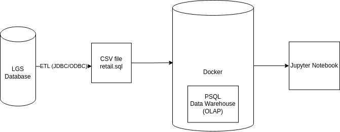

# Introduction
London Gift Shop (LGS) is a well-established UK-based online store specializing in gift-ware. With a primary customer base comprising wholesalers, LGS aims to enhance its revenue growth by leveraging the latest data technologies. The LGS marketing team seeks to gain deeper insights into customer behavior through a proof of concept (PoC) project. The goal is to analyze customer shopping patterns. The insights generated will be utilized by the marketing team to develop targeted campaigns such as email promotions and events to attract both new and existing customers. Technologies utilized include Python, Numpy, Pandas, Matplotlib, Docker, PSQL, and Jupyter Notebook.

# Implementation
## Project Architecture
The London Gift Shop (LGS) project architecture centers around understanding customer behavior and improving marketing strategies for the online store. The core components include the LGS online store, a dataset (retail.sql) spanning from 01/12/2009 to 09/12/2011, and an Extract, Transform, Load (ETL) process that removes personal information for privacy. Deployment involves running Jupyter Notebook via Docker on a virtual machine (VM), with results delivered to LGS through Jupyter Notebook and GitHub. The goal is to use insights from the analysis to guide LGS in improving targeted marketing campaigns, such as email, events, and promotions.

<p align="center">
  
</p>

```

```
## Data Analytics and Wrangling
Jupyter Notebook: [retail_data_analytics_wrangling.ipynb](python_data_analytics/retail_data_analytics_wrangling.ipynb)

The data analysis involves examining attributes such as invoice number, product code, product name, quantity, invoice date, unit price, customer ID, and country. The goal is to uncover patterns and trends in customer behavior, allowing the LGS marketing team to make informed decisions. The analytics results will guide the development of targeted marketing strategies, enabling LGS to increase revenue through personalized campaigns, promotions, and customer engagement initiatives.

# Improvements
Implement a predictive modeling component to forecast customer preferences and optimize inventory management.

Explore additional data sources beyond the provided dataset to enrich customer profiles and improve the accuracy of marketing strategies.

Integrate real-time data processing capabilities for more dynamic and adaptive marketing campaigns.

